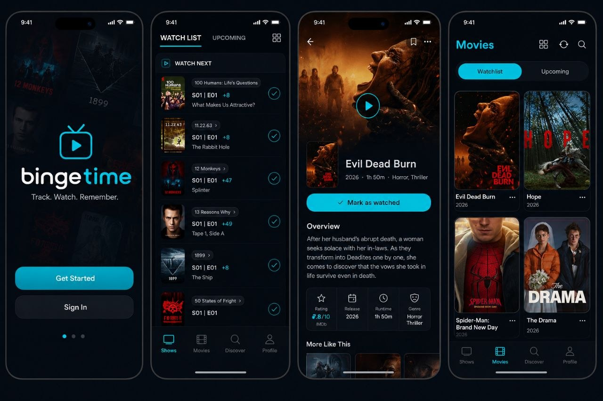

# BingeTime

A personal TV show and movie tracker built with Expo, React Native, Supabase, and TMDb. Your own private TV Time — no accounts, no cloud sync required (unless you want it).

⭐ Star this repo if you like it!



## Tech Stack

[](https://expo.dev)
[](https://reactnative.dev)
[](https://typescriptlang.org)
[](https://supabase.com)
[](https://www.themoviedb.org)
[](https://nativewind.dev)
[](https://zustand-demo.pmnd.rs)
[](https://tanstack.com/query)

---

## Overview

BingeTime is a **single-user, offline-first** tracker for TV shows and movies. It runs entirely on your device with a local Supabase database (PostgreSQL) and syncs metadata from TMDb.

| Tab | Purpose |
|-----|---------|
| **Shows** | Track episodes, seasons, progress; mark watching/finished/up-to-date/stopped |
| **Movies** | Track watched, watchlist, favorites, rewatch count |
| **Discover** | Trending, popular, top-rated from TMDb; add to library with one tap |
| **Profile** | Stats (watch time, streaks, genres, marathons), settings, theme picker |

**Key features**
- 6 built-in themes (Cinematic Dark, Midnight Blue, Forest, Amber Glow, Neon Cyber, Luminescent)
- FlashList for 60 FPS lists, `expo-image` for fast caching
- TanStack Query v5 with offline persistence (30 min gcTime)
- Push notifications for new episode airings (Expo Notifications)
- Zustand v5 persisted settings (`bingetime-settings`)
- Dark-first design, glassmorphism cards, Reanimated 4.5 transitions

---

## Quick Start

### Prerequisites
- Node 20+
- Expo CLI (`npm i -g @expo/cli`)
- Supabase project (local or cloud)
- TMDb API key (free at [themoviedb.org](https://www.themoviedb.org/settings/api))

### Install
```bash
git clone https://github.com/pranavlal18/bingetime.git
cd bingetime
npm install
```

### Environment
Create `.env` (gitignored) with:

```env
EXPO_PUBLIC_SUPABASE_URL=https://your-project.supabase.co
EXPO_PUBLIC_SUPABASE_ANON_KEY=your-anon-key
EXPO_PUBLIC_TMDB_API_KEY=your-tmdb-key
```

All vars use `EXPO_PUBLIC_*` prefix (Expo convention for client-side env vars).

### Database Setup
Run the consolidated schema in your Supabase SQL Editor (or via `supabase db push` if using local dev):

```bash
# The schema is at supabase/schema.sql
```

It merges all migrations into one idempotent script with RLS, indexes, triggers, and policies.

### Run
```bash
npm start        # Expo dev server
npm run android  # Android emulator/device
npm run ios      # iOS simulator/device
npm run web      # Browser
npm run typecheck # tsc --noEmit
```

---

## Architecture

| Layer | Technology |
|-------|------------|
| **Routing** | Expo Router (file-based, `app/`) |
| **Styling** | NativeWind v4  |
| **State** | Zustand v5 (persisted to AsyncStorage) |
| **Data Fetching** | TanStack React Query v5 (offline-first, persisted) |
| **Database** | Supabase (PostgreSQL) + TMDb REST API |
| **Lists** | @shopify/flash-list v2 |
| **Images** | expo-image |
| **Animations** | react-native-reanimated v4.5 |
| **Gestures** | react-native-gesture-handler |

### Project Structure
```
app/                          # Expo Router screens
├── _layout.tsx               # Root stack + providers
├── (tabs)/                   # Tab navigator (shows, movies, discover, profile)
│   ├── shows/index.tsx
│   ├── movies/index.tsx
│   ├── discover/index.tsx
│   └── profile/index.tsx
├── show/[id].tsx             # Show detail + episodes
├── movie/[id].tsx            # Movie detail
├── discover/trending.tsx
├── all-shows.tsx
├── all-movies.tsx
├── favorite-shows.tsx
├── favorite-movies.tsx
├── add-content.tsx
└── (auth)/                   # Login/register (Supabase Auth)

src/
├── components/               # UI components (ShowCard, MovieCard, stats, skeletons)
├── contexts/                 # AuthContext, ThemeContext
├── hooks/                    # useNotificationScheduler
├── lib/
│   ├── queries/              # React Query hooks per domain
│   ├── supabase.ts           # Supabase client
│   └── tmdb.ts               # TMDb API wrapper
├── stores/                   # Zustand store (appStore.ts)
├── themes/                   # 6 theme palettes + registry
├── types/                    # TypeScript interfaces
└── utils/                    # formatRuntime, formatDate, calcProgress, getYear

supabase/
├── schema.sql                # Consolidated database schema
└── migrations/               #  migration file (schema.sql)
```

---

## Database Schema

The complete schema is in **[supabase/schema.sql](supabase/schema.sql)**. It consolidates all 12 migrations into a single idempotent script.

### Tables
| Table | Purpose |
|-------|---------|
| `shows` | Reference data (TMDb/TVDb IDs, name, poster, status, genres, avg runtime) |
| `movies` | Reference data (TMDb ID, title, release date, runtime, genres) |
| `lists` | Custom lists (imported from TV Time, no UI yet) |
| `tmdb_cache` | TVDB → TMDb resolution cache |
| `user_shows` | Per-user show tracking (favorites, watchlist, progress, episodes seen) |
| `user_movies` | Per-user movie tracking (watched, watchlist, favorites, rewatch count) |
| `user_episodes` | Per-user episode watch events (season, episode, watched_at, rewatch) |

### Key Design Notes
- **Composite PKs**: `user_shows(show_id, user_id)`, `user_movies(movie_id, user_id)` for multi-user support
- **Unique constraint**: `user_episodes(show_id, season_number, episode_number, user_id)`
- **RLS enabled** on all tables; users only see/modify their own rows
- **Reference tables** globally readable; authenticated users can insert/upsert
- **`updated_at` triggers** on all user tables for optimistic updates
- **`genres` as `text[]`** on both `shows` and `movies`

### Schema Diagram
```
shows ◄──────────────► user_shows ◄──────────────► auth.users
  │                         │
  │                         ▼
  │                   user_episodes
  │                         │
  │                         ▼
  │                    (season, episode)
  │
  ▼
movies ◄───────────────► user_movies ◄──────────────► auth.users
```

---

## Theming System

6 built-in themes, switchable at runtime via Profile → Theme. Stored in Zustand (`bingetime-settings`).

| Theme | Key | Vibe |
|-------|-----|------|
| Cinematic Dark | `cinematic-dark` | Deep purple, film-noir |
| Midnight Blue | `midnight-blue` | Cool indigo |
| Forest | `forest` | Earthy greens |
| Amber Glow | `amber-glow` | Warm amber |
| Neon Cyber | `neon-cyber` | Cyan/pink synthwave |
| Luminescent | `luminescent` | Clean light mode |

---

## Development

### Commands
```bash
npm start          # Expo dev server
npm run android    # Android emulator/device
npm run ios        # iOS simulator/device
npm run web        # Browser (Expo Web)
npm run typecheck  # tsc --noEmit
```

### Gotchas
- **Metro**: `metro.config.js` adds `'csv'` to `assetExts` (for bundled CSV imports, though TV Time import is currently disabled)
- **Babel**: `react-native-reanimated/plugin` **must be last** in `plugins` array
- **React Query defaults** (in `app/_layout.tsx`): `staleTime: 5m`, `gcTime: 24h`, `retry: 2`, `networkMode: 'offlineFirst'`
  - Per-query overrides in `src/lib/queries/`: shows 2m, movies 5m, trending 10m, TMDb details 1h
- **Zustand selectors** used directly in list items (not Context) for granular re-renders
- **Single-user**:  Supabase Auth is wired but optional
- **Image domains**: Configured in `app.json` for `image.tmdb.org`

---

## License

Apache-2.0 — see [LICENSE](LICENSE) for details.